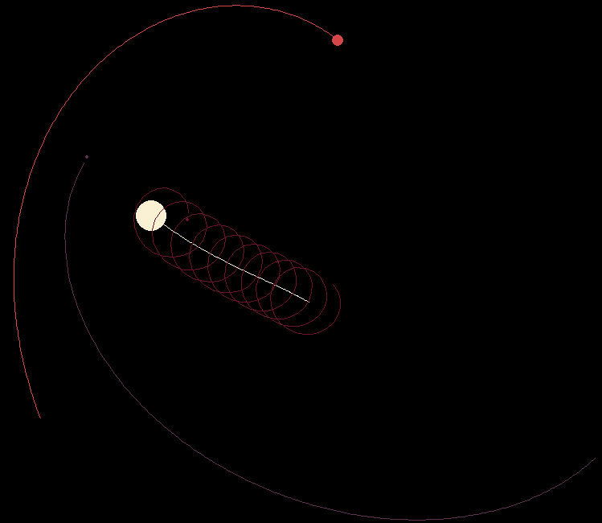

# N-body problem simulator
This little simulation allows to add several particles with different masses, each of which will influence all other
particles with its mass.

The particles get a random color, and they leave a trail which denotes their trajectory.

## Controls
- Primary mouse button: click and drag to create particles
- R: reset the simulation
- P: pause the simulation
- WASD/arrow keys: move the camera
- \+/-: Increase and decrease camera speed
- TAB: focus camera on the next particle (move camera to stop following particles)